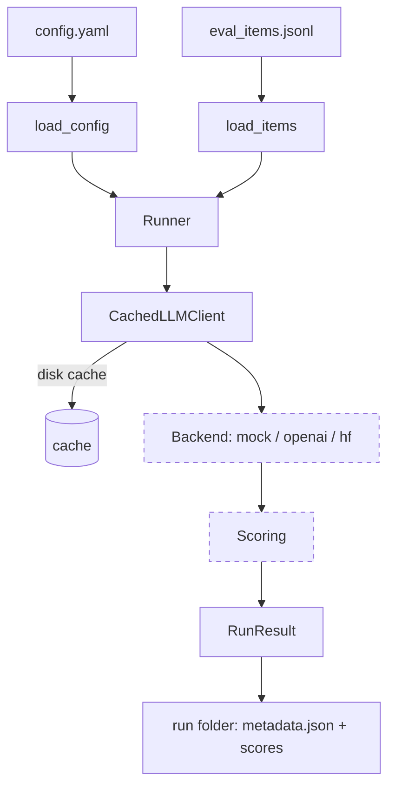

# mizan-evals

Reproducible evaluation harness for Arabic RAG and agent tool-calling, comparing
model behaviour on the **same intents in English, Modern Standard Arabic, and
Gulf dialect**.

[](https://github.com/SanaAraj/mizan-evals/actions/workflows/ci.yml)
[](LICENSE)
[](pyproject.toml)

> _Mīzān_ (ميزان) — "scale" / "balance". The tool weighs models fairly across
> languages.

## Why this exists

Arabic RAG and agent systems are usually evaluated with English-centric
harnesses, or not measured across dialects at all. The question this project is
built to answer cleanly is one nobody has published well: **how much does an
agent's function-calling accuracy degrade when the same request is written in
Arabic (MSA and Gulf dialect) instead of English?** Everything here is built so
that answer is reproducible from scratch and dated.

## Results

No measured results are published yet. Model execution and scoring land in
Milestone 2; until then, publishing numbers would violate the project's rule
against fabricated metrics. The tables below show the **shape** the harness will
populate, regenerated by `mizan run` and committed with model ids and run dates.

**Retrieval quality** (per language):

| Model | Language | recall@1 | recall@5 | MRR |
|-------|----------|----------|----------|-----|
| _TBD_ | en / msa / gulf | TBD | TBD | TBD |

**Tool-calling accuracy** — the headline comparison (per language):

| Model | Language | correct-tool rate | argument accuracy | hallucinated-tool rate |
|-------|----------|-------------------|-------------------|------------------------|
| _TBD_ | en / msa / gulf | TBD | TBD | TBD |

Milestone 1 (this release) ships the foundation: schemas, config, a cached and
resumable LLM client, retrieval scoring, and the `mizan run` skeleton.

## Architecture



Dashed nodes (real backends, judge-based scoring) arrive in later milestones.
The retrieval metrics and the run folder exist today.

## Quickstart

Requires Python 3.11+. [`uv`](https://docs.astral.sh/uv/) is recommended.

```bash
git clone https://github.com/SanaAraj/mizan-evals.git
cd mizan-evals

# Create an environment and install with dev tooling
uv venv --python 3.11
uv pip install -e ".[dev]"

# Optional: copy the env template (no keys needed for the mock backend)
cp .env.example .env

# Validate a config and create a timestamped run folder (no API calls)
mizan run --config configs/sample.yaml

# Run the checks
ruff check .
pytest
```

## Usage examples

`mizan run` validates the configuration, records reproducibility metadata, and
creates a run folder:

```console
$ mizan run --config configs/sample.yaml
run id     : 20260702T171127Z-sample-mock-run
created_at : 2026-07-02T17:11:27.102057+00:00
version    : 0.1.0
run dir    : runs/20260702T171127Z-sample-mock-run
dataset    : data/samples/eval_items.jsonl
models     : mock-small, mock-large
tasks      : retrieval, faithfulness, answer_quality, tool_calling
languages  : en, msa, gulf
note       : configuration validated and run folder created; model execution is not implemented yet (milestone 2).
```

Evaluation items are parallel across languages. A Gulf-dialect tool-calling item
(`sample-006`) and its gold tool call:

```json
{
  "id": "sample-006",
  "task_type": "tool_calling",
  "variants": {
    "en":   { "query": "What's the weather in Dubai tomorrow?" },
    "msa":  { "query": "ما حالة الطقس في دبي غدًا؟" },
    "gulf": { "query": "شلون الجو في دبي باچر؟" }
  },
  "gold": {
    "expected_tool": {
      "name": "get_weather",
      "arguments": { "city": "Dubai", "date": "tomorrow" }
    }
  }
}
```

Scoring is usable directly:

```python
from mizan.scoring import recall_at_k, mrr

recall_at_k(["arwiki:الرياض#0", "arwiki:مكة#0"], {"arwiki:الرياض#0"}, k=5)  # -> 1.0
mrr([(["x", "arwiki:الرياض#0"], {"arwiki:الرياض#0"})])                      # -> 0.5
```

## Evaluation methodology

- **Dataset.** Items are authored in parallel across English, MSA, and Gulf
  dialect and labelled by task type (`retrieval`, `faithfulness`,
  `answer_quality`, `tool_calling`). Native-speaker review of the Arabic content
  is part of the process. This release ships 10 clearly-marked **sample** items
  (`data/samples/`) as a format reference; the full set is authored separately.
- **Retrieval metrics.** `recall@k` uses the textbook definition
  `|relevant ∩ top-k| / |relevant|`; duplicate retrieved ids are collapsed
  before scoring so a system cannot inflate a score by repeating a document.
  `MRR` is the mean reciprocal rank of the first relevant document.
- **Reproducibility.** Every LLM call is cached to disk and keyed by model id,
  prompt, and decoding params, so interrupted runs resume without recomputation
  or re-billing. Each run folder records the resolved config, model ids, tool
  version, and a UTC timestamp.
- **Seeds.** A run-level `seed` is recorded in the config and metadata; decoding
  seeds are passed through to backends that support them.
- **Judge-based metrics** (faithfulness, answer quality) and their bias controls
  (answer-order swap, re-run consistency) are specified in the brief and land in
  Milestone 2.

## Limitations

- **No model execution yet.** Milestone 1 is the foundation: `mizan run`
  validates config and creates the run folder but performs no model calls.
- **Mock backend only.** Real backends (open-weight models via Hugging Face, an
  OpenAI-compatible endpoint) are not wired in yet.
- **No LLM-as-judge.** Faithfulness and answer-quality scoring, and the judge
  bias controls, are not implemented.
- **Sample dataset is a format reference, not an evaluation set.** It is 10
  items; document ids are illustrative and do not yet resolve to a built corpus.
- **Dialect coverage is Gulf-only** among Arabic dialects, and Gulf phrasings
  await native-speaker review.

## Roadmap

1. Real backends: open-weight models (ALLaM, Qwen, Jais) and one frontier
   reference model, behind the existing cache.
2. Tool-calling evaluation: correct-tool rate, argument accuracy, and
   hallucinated-tool rate across en / msa / gulf.
3. LLM-as-judge for faithfulness and answer quality, with documented bias
   controls.
4. Full parallel dataset (100–200 items) with native-speaker review.
5. Auto-generated, dated results tables wired into the README.

## License

[MIT](LICENSE)
