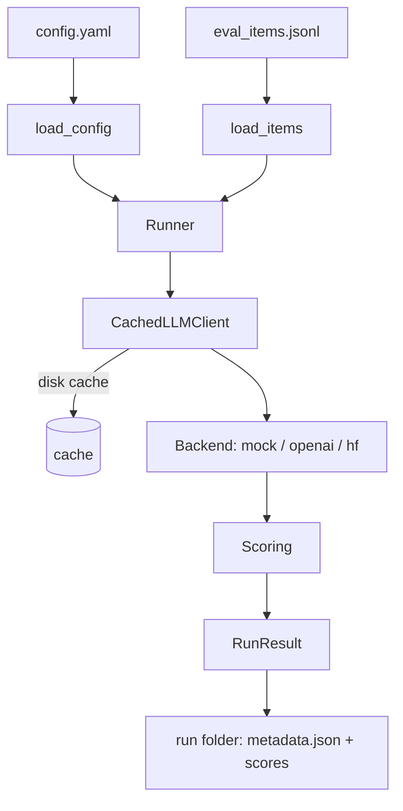

# mizan-evals

Reproducible evaluation harness for Arabic RAG and agent tool-calling, comparing
model behaviour on the **same intents in English, Modern Standard Arabic, and
Gulf dialect**.

[](https://github.com/SanaAraj/mizan-evals/actions/workflows/ci.yml)
[](LICENSE)
[](pyproject.toml)

> _Mīzān_ (ميزان) — "scale" / "balance". The tool weighs models fairly across
> languages.

## Why this exists

Arabic RAG and agent systems are usually evaluated with English-centric
harnesses, or not measured across dialects at all. The question this project is
built to answer cleanly is one nobody has published well: **how much does an
agent's function-calling accuracy degrade when the same request is written in
Arabic (MSA and Gulf dialect) instead of English?** Everything here is built so
that answer is reproducible from scratch and dated.

## Results

**Retrieval quality — BM25 lexical baseline** over the 15-item arwiki slice
(run 2026-07-03, offline and deterministic; regenerate with
`mizan run --config configs/retrieval-bm25.yaml`; archived run:
[`runs/archive/20260703T034326Z-retrieval-bm25-arwiki/`](runs/archive/20260703T034326Z-retrieval-bm25-arwiki/retrieval.md)):

| System | Language | recall@1 | recall@3 | recall@5 | recall@10 | MRR | n |
|---|---|---|---|---|---|---|---|
| bm25 | msa | 0.533 | 0.622 | 0.644 | 0.711 | 0.586 | 15 |
| bm25 | gulf | 0.356 | 0.622 | 0.622 | 0.756 | 0.541 | 15 |

On the same intents and corpus, BM25 loses ~18 points of recall@1 when the
query is phrased in Gulf dialect instead of MSA — the dialect gap this harness
is built to measure. The English lexical baseline over the Arabic corpus is
near zero by construction and is archived rather than tabulated; see
Limitations.

**Tool-calling accuracy** — the headline comparison (per language), lands in
Milestone 2:

| Model | Language | correct-tool rate | argument accuracy | hallucinated-tool rate |
|-------|----------|-------------------|-------------------|------------------------|
| _TBD_ | en / msa / gulf | TBD | TBD | TBD |

## Architecture



Backends (mock, OpenAI-compatible, Hugging Face), BM25 retrieval scoring, and
the run folder exist today; judge-based scoring lands in Milestone 2.

## Quickstart

Requires Python 3.11+. [`uv`](https://docs.astral.sh/uv/) is recommended.

```bash
git clone https://github.com/SanaAraj/mizan-evals.git
cd mizan-evals

# Create an environment and install with dev tooling
uv venv --python 3.11
uv pip install -e ".[dev]"

# Optional: copy the env template (no keys needed for the mock backend)
cp .env.example .env

# Run the offline BM25 retrieval eval (no API keys needed)
mizan run --config configs/retrieval-bm25.yaml

# Run the checks
ruff check .
pytest
```

## Usage examples

`mizan run` validates the configuration, records reproducibility metadata,
executes the run, and writes the results table into the run folder:

```console
$ mizan run --config configs/retrieval-bm25.yaml
run id     : 20260703T034326Z-retrieval-bm25-arwiki
created_at : 2026-07-03T03:43:26.901203+00:00
version    : 0.1.0
run dir    : runs/20260703T034326Z-retrieval-bm25-arwiki
models     : none-retrieval-only
tasks      : retrieval
languages  : msa, gulf
retrieval  : wrote retrieval.md
results    : 30 (0 cached, 0 errors)
```

Evaluation items are parallel across languages. A Gulf-dialect tool-calling item
(`sample-006`) and its gold tool call:

```json
{
  "id": "sample-006",
  "task_type": "tool_calling",
  "variants": {
    "en":   { "query": "What's the weather in Dubai tomorrow?" },
    "msa":  { "query": "ما حالة الطقس في دبي غدًا؟" },
    "gulf": { "query": "شلون الجو في دبي باچر؟" }
  },
  "gold": {
    "expected_tool": {
      "name": "get_weather",
      "arguments": { "city": "Dubai", "date": "tomorrow" }
    }
  }
}
```

Scoring is usable directly:

```python
from mizan.scoring import recall_at_k, mrr

recall_at_k(["arwiki:الرياض#0", "arwiki:مكة#0"], {"arwiki:الرياض#0"}, k=5)  # -> 1.0
mrr([(["x", "arwiki:الرياض#0"], {"arwiki:الرياض#0"})])                      # -> 0.5
```

## Evaluation methodology

- **Dataset.** Items are authored in parallel across English, MSA, and Gulf
  dialect and labelled by task type (`retrieval`, `faithfulness`,
  `answer_quality`, `tool_calling`). The 15-item retrieval slice
  (`data/retrieval/`, over 12 pinned Arabic Wikipedia revisions) is
  **LLM-drafted and LLM-QA'd**: the QA pass checked cross-lingual semantic
  consistency, MSA grammaticality, Gulf dialect plausibility, and that every
  gold chunk answers its query. Native-speaker review is **pending** and
  tracked per item via `review_status` (`llm_qa` today, promoted to
  `native_reviewed` as that pass lands). 10 clearly-marked **sample** items
  (`data/samples/`) remain as a format reference.
- **Retrieval metrics.** `recall@k` uses the textbook definition
  `|relevant ∩ top-k| / |relevant|`; duplicate retrieved ids are collapsed
  before scoring so a system cannot inflate a score by repeating a document.
  `MRR` is the mean reciprocal rank of the first relevant document.
- **Reproducibility.** Every LLM call is cached to disk and keyed by model id,
  prompt, and decoding params, so interrupted runs resume without recomputation
  or re-billing. Each run folder records the resolved config, model ids, tool
  version, and a UTC timestamp; runs backing published tables are archived
  under `runs/archive/`.
- **Seeds.** A run-level `seed` is recorded in the config and metadata; decoding
  seeds are passed through to backends that support them.
- **Judge-based metrics** (faithfulness, answer quality) and their bias controls
  (answer-order swap, re-run consistency) are specified in the brief and land in
  Milestone 2.

## Limitations

- **No native-speaker review has been completed.** The retrieval slice is
  LLM-drafted and LLM-QA'd only (`review_status: "llm_qa"` on every item,
  enforced by tests); a native-speaker pass is pending and tracked per item.
- **No published LLM results yet.** The evaluation loop, cached client, and
  backends (mock, OpenAI-compatible, Hugging Face) are implemented, but only
  the offline BM25 retrieval numbers are published; the first LLM-backed
  results (tool calling) land in Milestone 2.
- **English is excluded from the lexical retrieval table.** Measured once and
  [archived](runs/archive/20260703T030732Z-retrieval-bm25-arwiki/retrieval.md),
  BM25 for English queries over the Arabic corpus scores recall@5 = 0.067,
  MRR = 0.043 — near zero by construction, since English shares almost no
  surface forms with the corpus. That floor is a finding in itself and the
  motivation for the Milestone 3 dense-retrieval comparison, where
  cross-lingual retrieval becomes meaningful. English remains fully in scope
  for the tool-calling eval, the project's headline comparison.
- **No LLM-as-judge.** Faithfulness and answer-quality scoring, and the judge
  bias controls, are not implemented.
- **Small retrieval slice.** 15 items over a 12-document corpus is a regression
  gate and a demonstration of method, not a benchmark; corpus and item-set
  expansion are roadmap items. The 10 sample items (`data/samples/`) are a
  format reference only.
- **Dialect coverage is Gulf-only** among Arabic dialects.

## Roadmap

1. Real backends: open-weight models (ALLaM, Qwen, Jais) and one frontier
   reference model, behind the existing cache.
2. Tool-calling evaluation: correct-tool rate, argument accuracy, and
   hallucinated-tool rate across en / msa / gulf.
3. LLM-as-judge for faithfulness and answer quality, with documented bias
   controls.
4. Full parallel dataset (100–200 items) with native-speaker review.
5. Auto-generated, dated results tables wired into the README.

## License

[MIT](LICENSE)
